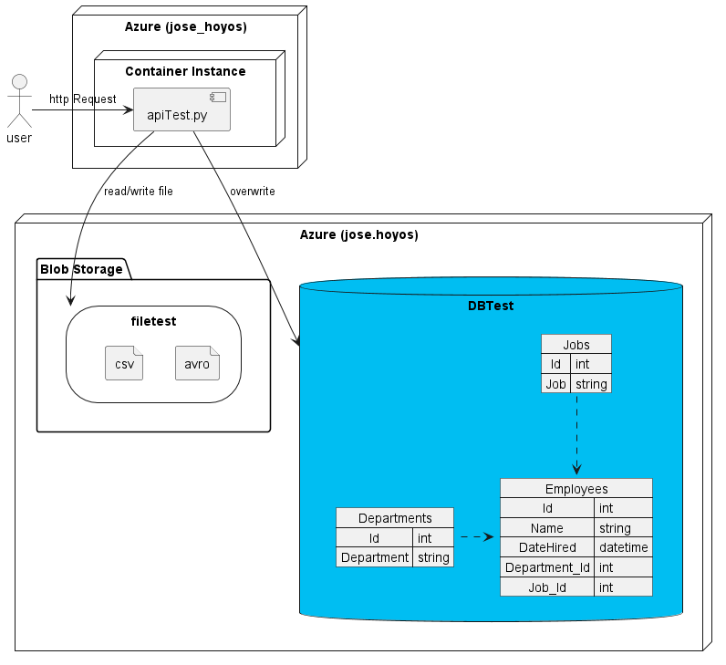

# API Test

Esta es una API construida con **FastAPI** que se conecta a una base de datos y utiliza Azure Blob Storage para almacenamiento de archivos. La API permite la manipulación de datos usando pandas y la lectura/escritura de archivos Avro.

## Características

- **Framework**: FastAPI para la creación de rutas y endpoints.
- **Base de Datos**: Conexión a bases de datos SQL usando `pyodbc` y `SQLAlchemy`.
- **Seguridad**: Implementación de autenticación mediante una clave API.
- **Azure Blob Storage**: Interacción con Azure Blob para almacenamiento en la nube.
- **Manejo de Archivos**: Uso de `fastavro` para trabajar con archivos Avro.

## Requisitos Previos

- **Python 3.8+**
- **Docker** (para ejecutar en un contenedor)
- Cuenta de **Azure** para utilizar el almacenamiento en Blob.
- Una base de datos compatible con **ODBC**.

## Instalación

1. Clona el repositorio:

    ```bash
    git clone https://github.com/jose8305/Challenge.git
    cd Challenge
    ```

2. Instala las dependencias:

    ```bash
    pip install -r requirements.txt
    ```

3. Configura las variables de entorno para la conexión a la base de datos y el almacenamiento de Azure:

    ```bash
    export DATABASE_URL="mssql+pyodbc://<usuario>:<password>@<host>/<base_de_datos>?driver=ODBC+Driver+17+for+SQL+Server"
    export AZURE_STORAGE_CONNECTION_STRING="your_connection_string"
    export API_KEY="tu_clave_api"
    ```

## Ejecución

Para iniciar la aplicación de desarrollo, ejecuta:

```bash
uvicorn apiTest:app --reload
```

## Producción

Para iniciar la aplicación ve al siguiente link: http://20.22.36.209:8000/docs

Para ver el informe ve al siguiente link: https://app.powerbi.com/view?r=eyJrIjoiMjJhZGQ5YTEtYWM1OS00MzQ5LWI0OGMtN2IxNWVjYmJjOWM0IiwidCI6Ijc2YmNkNGY1LTBmMjUtNDZiNy1hN2IwLTlkY2U0OWFkMWJhYSIsImMiOjR9


## Diagrama de Arquitectura

A continuación se muestra un diagrama de la arquitectura:



El diagrama describe el flujo de interacción entre el **Usuario**, la **API**, la **Base de Datos** y **Azure Blob Storage**.

